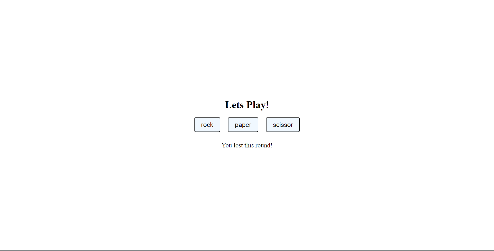

# Rock Paper Scissors 

A functional JavaScript game played . This project was built as the first logic challenge in [The Odin Project](https://www.theodinproject.com) Foundations.

## 🧠 Project Concept
The goal was to create a game that challenges human against a computer. 

## 🛠️ Logic & Features
* **Randomized Computer Choice:** Implementation of `Math.random()` to generate unpredictable moves for the AI.
* **Input Handling:** Used `prompt()` for user input with case-insensitivity logic (e.g., "RoCk" becomes "rock").
* **Game State Management:** Tracks scores across 5 rounds using global and local variables.
* **Functional Programming:** Modularized code into specific functions like `playRound()` and `playGame()`.

## 🎮 How to Play
1. Open the [Live Demo](https://codamee.github.io/rock-paper-scissors/).
2. Follow the prompts to enter your choice!

---

